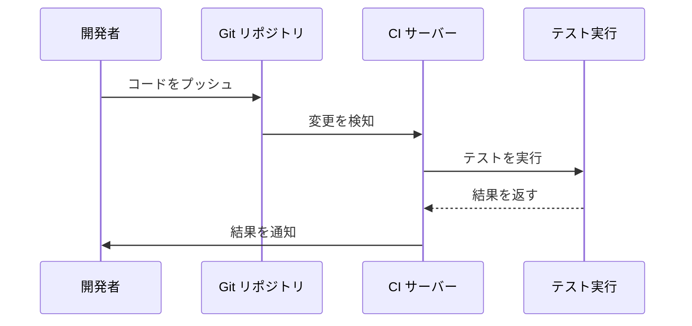
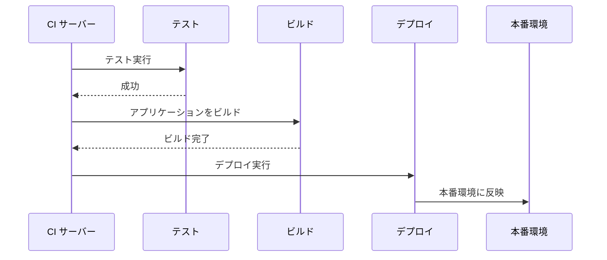
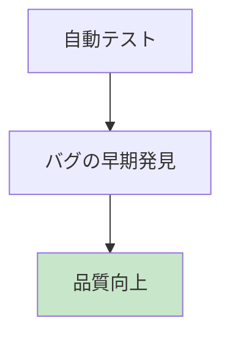
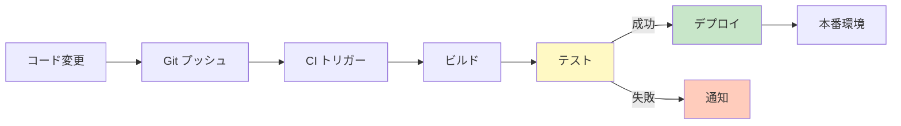
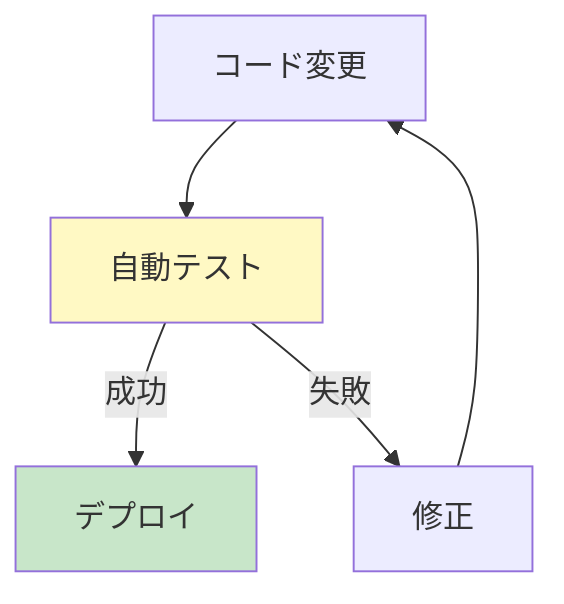

# CI/CD 入門講座

CI/CD の基礎を学びましょう。

## 目次

1. [CI/CD とは？](#cicd-とは)
2. [CI（継続的インテグレーション）とは？](#ci継続的インテグレーションとは)
3. [CD（継続的デプロイ）とは？](#cd継続的デプロイとは)
4. [CI/CD のメリット](#cicd-のメリット)
5. [CI/CD の流れ](#cicd-の流れ)
6. [まとめ](#まとめ)

---

## CI/CD とは？

**CI/CD** = Continuous Integration / Continuous Deployment（継続的インテグレーション / 継続的デプロイ）

コードの変更を自動的にテストし、本番環境にデプロイする仕組みです。

### 従来の開発の問題


**よくある問題**:

- テストを忘れる
- デプロイ手順が複雑でミスが起きる
- 本番環境でバグが発見される
- デプロイに時間がかかる

### CI/CD を使った場合


**改善点**:

- テストが自動実行される
- デプロイが自動化される
- ミスが減る
- 開発速度が向上する

---

## CI（継続的インテグレーション）とは？

開発者がコードを変更するたびに、自動的にテストを実行する仕組みです。

### CI の流れ



### CI で実行されること

1. **コードの取得**: Git リポジトリから最新のコードを取得
2. **ビルド**: アプリケーションをビルド（コンパイル）
3. **テスト実行**: 自動テストを実行
4. **結果通知**: 成功/失敗を開発者に通知

### CI のメリット

- **早期のバグ発見**: コード変更直後に問題を検出
- **品質の向上**: テストが必須になる
- **開発速度の向上**: 手動テストが不要

---

## CD（継続的デプロイ）とは？

テストが成功したら、自動的に本番環境にデプロイする仕組みです。

### CD の流れ



### CD の種類

#### 1. Continuous Delivery（継続的デリバリー）

自動的にデプロイ可能な状態まで準備するが、デプロイは手動で実行。


#### 2. Continuous Deployment（継続的デプロイ）

テストが成功したら、自動的に本番環境にデプロイ。


---

## CI/CD のメリット

### 1. 品質の向上



- テストが自動実行されるため、バグを見逃しにくい
- コードレビューと組み合わせて、品質を保証

### 2. 開発速度の向上

- 手動テスト・デプロイの時間を削減
- 開発者はコードに集中できる

### 3. リスクの低減

- デプロイ手順が標準化される
- 人的ミスが減る
- ロールバック（元に戻す）が容易

### 4. チーム開発の効率化

- 複数の開発者が同時に開発しても、統合がスムーズ
- コンフリクト（競合）を早期に発見

---

## CI/CD の流れ

### 典型的な CI/CD パイプライン



### ステップの詳細

#### 1. コード変更

開発者がコードを変更し、Git リポジトリにプッシュします。

#### 2. CI トリガー

Git リポジトリの変更を検知して、CI パイプラインが自動的に開始されます。

#### 3. ビルド

アプリケーションをビルド（コンパイル）します。

**例**:

- Java: JAR ファイルの作成
- Node.js: 依存関係のインストール
- Docker: イメージのビルド

#### 4. テスト

各種テストを自動実行します。

**テストの種類**:

- **ユニットテスト**: 個々の機能のテスト
- **統合テスト**: 複数の機能を組み合わせたテスト
- **E2E テスト**: エンドツーエンドのテスト

#### 5. デプロイ

テストが成功したら、本番環境にデプロイします。

**デプロイの種類**:

- **ブルー・グリーンデプロイ**: 新しい環境を用意して切り替え
- **ローリングデプロイ**: 段階的に更新
- **カナリアデプロイ**: 一部のサーバーだけ更新して検証

---

## CI/CD ツール

### 代表的な CI/CD ツール

| ツール             | 特徴                          |
| ------------------ | ----------------------------- |
| **GitHub Actions** | GitHub と統合、無料プランあり |
| **GitLab CI/CD**   | GitLab と統合                 |
| **Jenkins**        | オープンソース、柔軟性が高い  |
| **CircleCI**       | クラウド型、設定が簡単        |
| **Travis CI**      | クラウド型、GitHub と連携     |

### CI/CD ツールの選び方

- **小規模プロジェクト**: GitHub Actions、GitLab CI/CD
- **大規模プロジェクト**: Jenkins、CircleCI
- **クラウド利用**: GitHub Actions、CircleCI
- **オンプレミス**: Jenkins、GitLab CI/CD

---

## CI/CD のベストプラクティス

### 1. テストを自動化



- すべてのテストを自動実行
- テストが失敗したらデプロイを停止

### 2. 段階的なデプロイ


- 開発環境 → ステージング環境 → 本番環境の順でデプロイ
- 各環境でテストを実行

### 3. ロールバックの準備

デプロイに失敗した場合、すぐに元に戻せるように準備しておく。

### 4. 通知の設定

- テスト失敗時に開発者に通知
- デプロイ成功時にチームに通知

---

## まとめ

### 学んだこと

- ✅ **CI** はコード変更のたびに自動テストを実行
- ✅ **CD** はテスト成功後に自動デプロイ
- ✅ **品質向上**と**開発速度向上**に貢献
- ✅ **人的ミスを減らし**、**リスクを低減**

### CI/CD の基本フロー

```
コード変更 → Git プッシュ → 自動テスト → 自動デプロイ → 本番環境
```

### 次のステップ

1. [ユニットテスト入門](./unittest.md) でテストの基礎を学ぶ
2. GitHub Actions や GitLab CI/CD を試してみる
3. 実際のプロジェクトで CI/CD を導入してみる

---

## 参考リンク

- [GitHub Actions ドキュメント](https://docs.github.com/ja/actions)
- [GitLab CI/CD ドキュメント](https://docs.gitlab.com/ee/ci/)
- [Jenkins 公式サイト](https://www.jenkins.io/)
