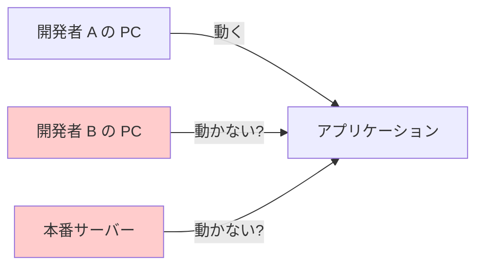
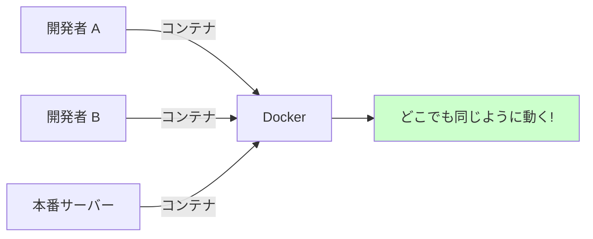
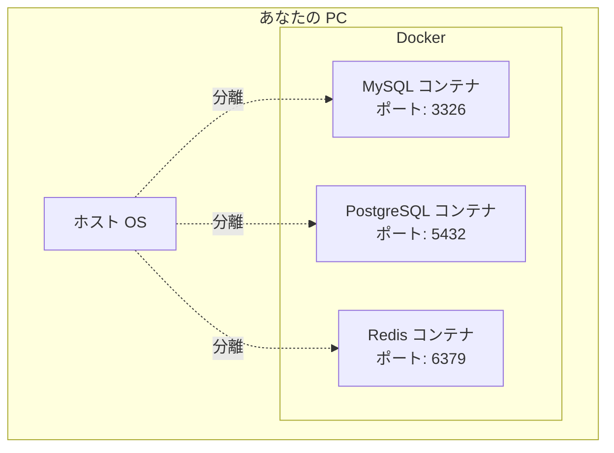
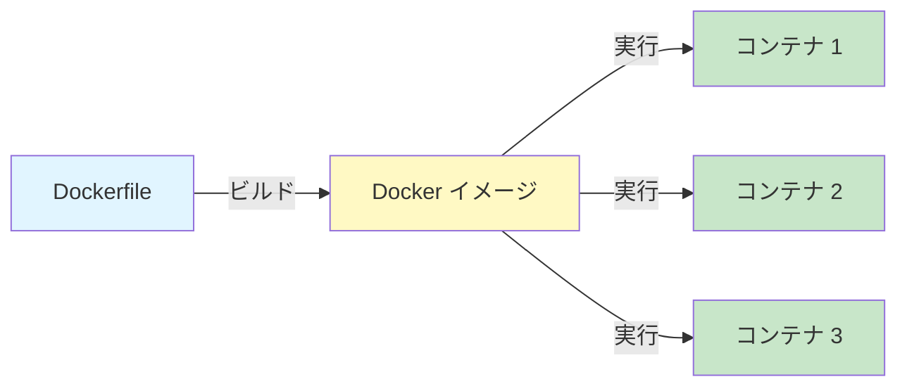
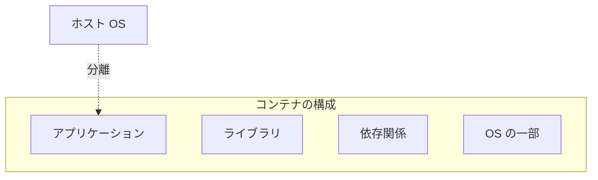
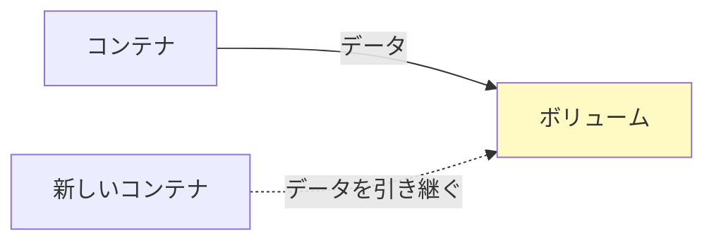
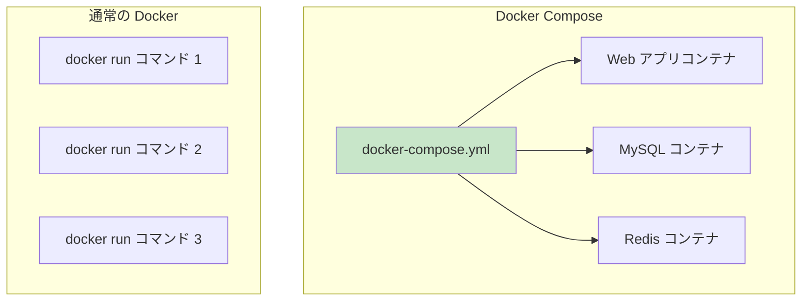
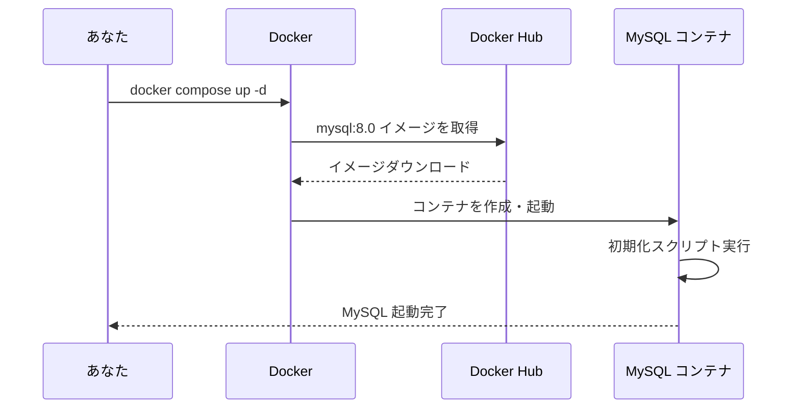
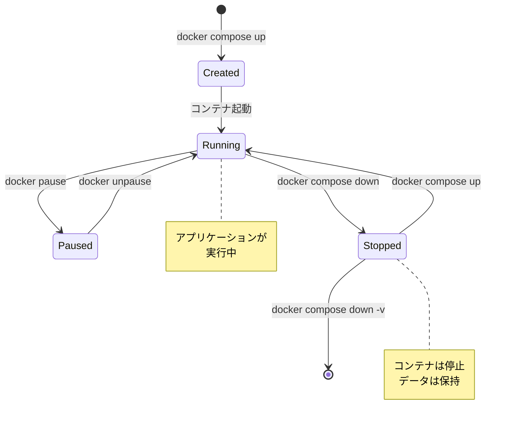

# Docker 入門講座

Docker を初めて学ぶ方向けの講座です。基礎から実践まで、段階的に学んでいきましょう。

## 目次

1. [Docker とは？](#docker-とは)
2. [なぜ Docker を使うのか？](#なぜ-docker-を使うのか)
3. [Docker の基本概念](#docker-の基本概念)
4. [Docker のインストール](#docker-のインストール)
5. [Docker の基本コマンド](#docker-の基本コマンド)
6. [Docker Compose とは？](#docker-compose-とは)
7. [実践: MySQL を Docker で動かす](#実践-mysql-を-docker-で動かす)
8. [まとめ](#まとめ)

---

## Docker とは？

Docker は、アプリケーションとその実行環境を**コンテナ**という単位でパッケージ化し、どこでも同じように動かせるようにする技術です。

### 従来の開発環境の問題



**よくある問題**:

- 「私の環境では動くのに...」
- OS やバージョンの違いで動作が変わる
- 環境構築に時間がかかる

### Docker を使った場合



---

## なぜ Docker を使うのか？

### 1. 環境の一貫性

開発環境、テスト環境、本番環境で**全く同じ環境**を使えます。

### 2. 簡単なセットアップ

複雑な環境構築が `docker compose up` 一つで完了します。

```bash
# これだけで MySQL が起動！
docker compose up -d
```

### 3. 分離された環境

アプリケーションごとに独立した環境を作れます。



### 4. クリーンな環境

不要になったら削除するだけ。PC を汚しません。

---

## Docker の基本概念

### イメージ (Image)

アプリケーションの**設計図**のようなもの。



**例**: `mysql:8.0` というイメージから MySQL コンテナを起動できます。

### コンテナ (Container)

イメージから作られた**実行中のアプリケーション**。



### ボリューム (Volume)

データを**永続的に保存**する場所。



---

## Docker のインストール

### Windows (WSL2 使用)

1. Docker Desktop をインストール

   - https://www.docker.com/products/docker-desktop/

2. WSL2 で Docker が使えることを確認

```bash
docker --version
docker compose version
```

### Mac

1. Docker Desktop をインストール

   - https://www.docker.com/products/docker-desktop/

2. ターミナルで確認

```bash
docker --version
docker compose version
```

---

## Docker の基本コマンド

### イメージ関連

```bash
# イメージ一覧を表示
docker images

# イメージをダウンロード
docker pull mysql:8.0

# イメージを削除
docker rmi mysql:8.0
```

### コンテナ関連

```bash
# 実行中のコンテナを表示
docker ps

# 全てのコンテナを表示（停止中も含む）
docker ps -a

# コンテナを起動
docker start <コンテナ名>

# コンテナを停止
docker stop <コンテナ名>

# コンテナを削除
docker rm <コンテナ名>

# コンテナのログを表示
docker logs <コンテナ名>

# コンテナに入る
docker exec -it <コンテナ名> bash
```

### システム関連

```bash
# Docker の情報を表示
docker info

# 使用していないリソースを削除
docker system prune
```

---

## Docker Compose とは？

複数のコンテナを**まとめて管理**するツールです。

### Docker vs Docker Compose



### docker-compose.yml の例

```yaml
version: "3.8"
services:
  mysql:
    image: mysql:8.0
    ports:
      - "3326:3306"
    environment:
      MYSQL_ROOT_PASSWORD: rootpassword
      MYSQL_DATABASE: web_sample_db
      MYSQL_USER: user
      MYSQL_PASSWORD: password
    volumes:
      - mysql_data:/var/lib/mysql

volumes:
  mysql_data:
```

### Docker Compose の基本コマンド

```bash
# コンテナを起動（バックグラウンド）
docker compose up -d

# コンテナを停止
docker compose down

# コンテナを停止してボリュームも削除
docker compose down -v

# ログを表示
docker compose logs

# ログをリアルタイム表示
docker compose logs -f
```

---

## 実践: MySQL を Docker で動かす

### Step 1: docker-compose.yml の例

MySQL を起動するための `docker-compose.yml` の例です。

```yaml
version: "3.8"
services:
  mysql:
    image: mysql:8.0 # MySQL 8.0 のイメージを使用
    container_name: my-mysql # コンテナ名
    ports:
      - "3306:3306" # ホスト:コンテナ のポートマッピング
    environment: # 環境変数
      MYSQL_ROOT_PASSWORD: rootpassword
      MYSQL_DATABASE: my_database
      MYSQL_USER: myuser
      MYSQL_PASSWORD: mypassword
    volumes:
      - mysql_data:/var/lib/mysql # データを永続化

volumes:
  mysql_data: # 名前付きボリューム
```

### Step 2: MySQL を起動

```bash
docker compose up -d
```

**実行される処理**:



### Step 3: コンテナの状態を確認

```bash
docker ps
```

**出力例**:

```
CONTAINER ID   IMAGE       PORTS                    STATUS
abc123def456   mysql:8.0   0.0.0.0:3326->3306/tcp   Up 10 seconds
```

### Step 4: MySQL に接続

```bash
# コンテナの中に入る
docker exec -it my-mysql mysql -umyuser -pmypassword my_database

# または、ホストから接続
mysql -h 127.0.0.1 -P 3306 -u myuser -pmypassword my_database
```

### Step 5: データの確認

```sql
-- データベース一覧を表示
SHOW DATABASES;

-- テーブル一覧を表示
SHOW TABLES;
```

### Step 6: 停止と削除

```bash
# 停止（データは保持）
docker compose down

# 停止してデータも削除
docker compose down -v
```

---

## コンテナのライフサイクル



---

## ベストプラクティス

### 1. ボリュームを使ってデータを永続化

```yaml
volumes:
  - mysql_data:/var/lib/mysql # ✅ 良い例
```

### 2. 環境変数でパスワードを管理

```yaml
environment:
  MYSQL_PASSWORD: ${DB_PASSWORD} # .env ファイルから読み込む
```

### 3. ポート番号を変えて衝突を避ける

```yaml
ports:
  - "3326:3306" # ホストの 3306 が使用中なら別のポートに
```

### 4. 定期的にクリーンアップ

```bash
# 使用していないコンテナ・イメージ・ボリュームを削除
docker system prune -a
```

---

## トラブルシューティング

### ポートが既に使用されている

```bash
# ポート使用状況を確認（Linux/Mac）
lsof -i :3306

# Windows の場合
netstat -ano | findstr :3306

# 必要に応じてプロセスを終了
kill -9 <PID>  # Linux/Mac
taskkill /PID <PID> /F  # Windows
```

### コンテナが起動しない

```bash
# ログを確認
docker compose logs mysql

# コンテナの状態を詳細表示
docker inspect my-mysql
```

### データベースに接続できない

```bash
# コンテナが起動しているか確認
docker ps

# ネットワーク設定を確認
docker network ls
docker network inspect <network-name>
```

### データをリセットしたい

```bash
# 全てのデータを削除して再起動
docker compose down -v
docker compose up -d
```

---

## まとめ

### 学んだこと

- ✅ Docker はアプリケーションを**コンテナ**で動かす技術
- ✅ Docker Compose で**複数のコンテナ**を簡単に管理
- ✅ **どこでも同じ環境**で開発できる
- ✅ **簡単にクリーンアップ**できる

### 基本コマンドまとめ

```bash
# 起動
docker compose up -d

# 停止
docker compose down

# 状態確認
docker ps

# ログ確認
docker compose logs

# クリーンアップ
docker system prune
```

### 次のステップ

1. [ウェブアプリケーション入門](./webapplication.md) で実際にアプリケーションと連携
2. 自分で `docker-compose.yml` をカスタマイズしてみる
3. 他のデータベース（PostgreSQL、MongoDB など）も試してみる

---

## 参考リンク

- [Docker 公式ドキュメント](https://docs.docker.com/)
- [Docker Compose 公式ドキュメント](https://docs.docker.com/compose/)
- [Docker Hub](https://hub.docker.com/) - 公式イメージの検索
