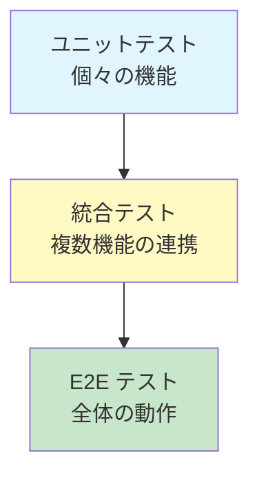
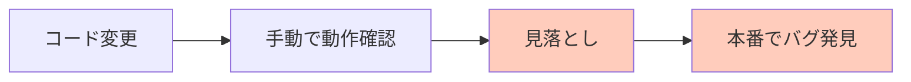
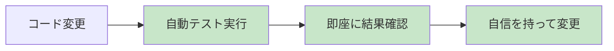
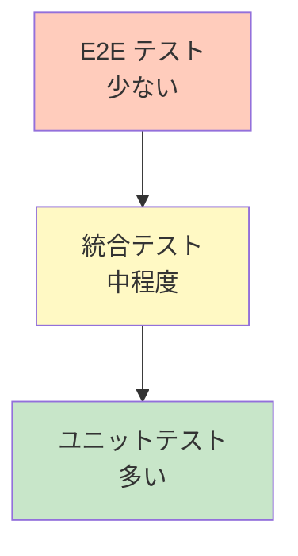
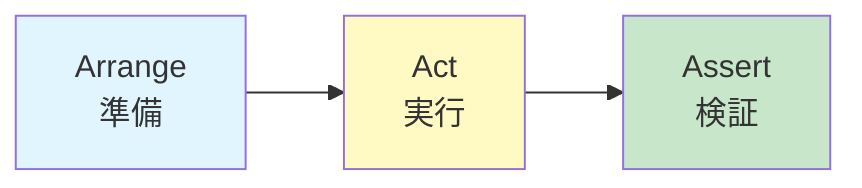
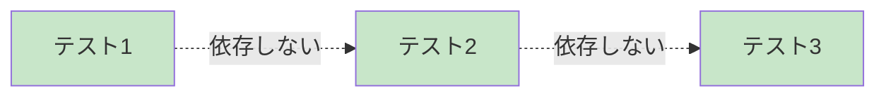
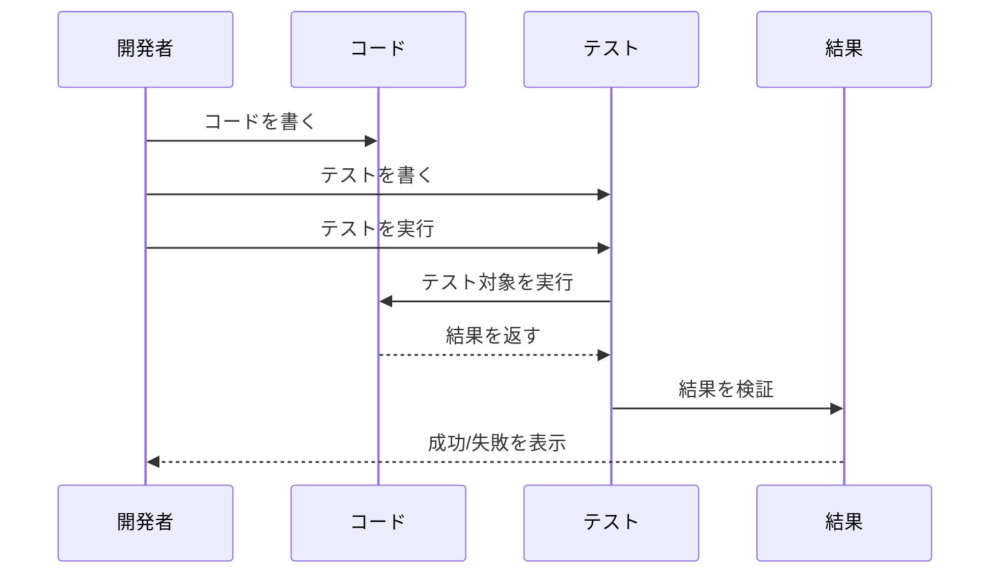
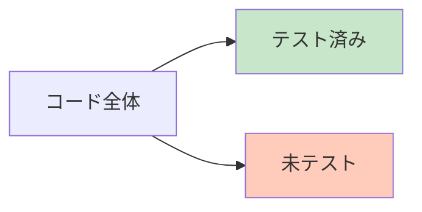
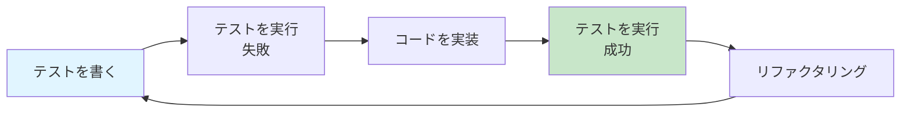
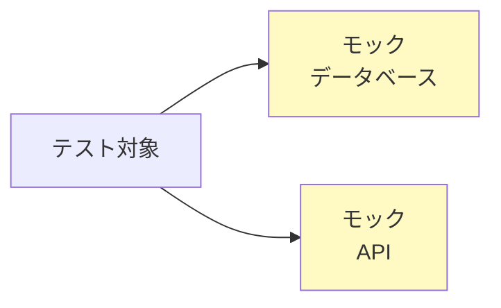

# ユニットテスト入門講座

ユニットテストの基礎を学びましょう。

## 目次

1. [ユニットテストとは？](#ユニットテストとは)
2. [なぜユニットテストが必要？](#なぜユニットテストが必要)
3. [テストの種類](#テストの種類)
4. [良いテストの書き方](#良いテストの書き方)
5. [テストの実行](#テストの実行)
6. [まとめ](#まとめ)

---

## ユニットテストとは？

**ユニットテスト**は、プログラムの小さな単位（関数やメソッド）を個別にテストする方法です。

### テストの階層



### ユニットテストの例

**テスト対象の関数**:

```
関数: calculateTotal(price, quantity)
- price: 価格
- quantity: 数量
- 戻り値: 合計金額
```

**テストケース**:

1. 正常系: price=100, quantity=2 → 200 を返す
2. 異常系: price=-100 → エラーを返す
3. 境界値: quantity=0 → 0 を返す

---

## なぜユニットテストが必要？

### テストがない場合の問題



**よくある問題**:

- 変更の影響範囲がわからない
- バグを発見するのが遅れる
- リファクタリング（コード改善）が怖い
- 手動テストに時間がかかる

### ユニットテストがある場合



**メリット**:

- 変更の影響を即座に確認
- バグを早期発見
- リファクタリングが安心
- テストが自動実行される

---

## テストの種類

### テストピラミッド



### 1. ユニットテスト

個々の関数やメソッドをテストします。

**特徴**:

- 実行が速い
- 数が多い
- 個別の機能を検証

**例**: 計算関数、文字列処理関数

### 2. 統合テスト

複数の機能を組み合わせてテストします。

**特徴**:

- 実行が中程度の速度
- 数は中程度
- 機能間の連携を検証

**例**: データベースとの連携、API の呼び出し

### 3. E2E テスト（エンドツーエンドテスト）

アプリケーション全体の動作をテストします。

**特徴**:

- 実行が遅い
- 数は少ない
- ユーザー視点での動作を検証

**例**: ブラウザでの操作、API の一連の流れ

---

## 良いテストの書き方

### テストの基本構造

テストは通常、以下の 3 つのステップで構成されます。



#### 1. Arrange（準備）

テストに必要なデータや状態を準備します。

**例**:

- テストデータの作成
- モック（偽物）オブジェクトの準備

#### 2. Act（実行）

テスト対象の関数やメソッドを実行します。

**例**:

- 関数を呼び出す
- メソッドを実行する

#### 3. Assert（検証）

実行結果が期待通りか確認します。

**例**:

- 戻り値が正しいか
- エラーが発生したか

### テストの例

**テスト対象**:

```
関数: isAdult(age)
- age が 18 以上なら true
- age が 18 未満なら false
```

**テストケース**:

```
テスト1: 正常系（18歳以上）
- Arrange: age = 20
- Act: isAdult(20) を実行
- Assert: 戻り値が true であること

テスト2: 正常系（18歳未満）
- Arrange: age = 15
- Act: isAdult(15) を実行
- Assert: 戻り値が false であること

テスト3: 境界値（18歳）
- Arrange: age = 18
- Act: isAdult(18) を実行
- Assert: 戻り値が true であること
```

### 良いテストの特徴

#### 1. 独立性

各テストは他のテストに依存しない。



#### 2. 再現性

何度実行しても同じ結果になる。

#### 3. 明確性

テストの意図が明確で、読みやすい。

#### 4. 速い実行

テストは短時間で実行できる。

---

## テストの実行

### テスト実行の流れ



### テストの実行タイミング

#### 1. 開発中

コードを書いたら、すぐにテストを実行。

#### 2. コミット前

Git にコミットする前に、すべてのテストを実行。

#### 3. CI/CD パイプライン

コードをプッシュしたら、自動的にテストを実行。

### テストカバレッジ

テストがコードのどの部分をカバーしているかを示す指標です。



**カバレッジの目安**:

- 80% 以上: 良好
- 60-80%: 普通
- 60% 未満: 改善が必要

**注意**: カバレッジが高くても、テストの質が低ければ意味がない。

---

## テストのベストプラクティス

### 1. テストファースト（TDD）

テストを先に書いてから、コードを実装する方法。



### 2. テストの命名規則

テストの名前から、何をテストしているかわかるようにする。

**良い例**:

- `test_isAdult_returnsTrue_whenAgeIs20`
- `test_calculateTotal_returnsCorrectValue`

**悪い例**:

- `test1`
- `test_function`

### 3. テストデータの管理

テストデータは明確に定義し、再利用可能にする。

### 4. モックの活用

外部依存（データベース、API など）をモック（偽物）で置き換える。



**メリット**:

- テストが速い
- 外部環境に依存しない
- テストが安定する

---

## まとめ

### 学んだこと

- ✅ **ユニットテスト**は個々の機能をテストする
- ✅ **早期のバグ発見**と**リファクタリングの安心感**を提供
- ✅ **テストピラミッド**でバランスの取れたテストを書く
- ✅ **Arrange-Act-Assert**の構造でテストを書く
- ✅ **独立性**と**再現性**が重要

### テストの基本

```
1. テストを書く
2. テストを実行
3. 結果を確認
4. 必要に応じて修正
```

### 次のステップ

1. [CI/CD 入門](./cicd.md) で自動テストの仕組みを学ぶ
2. 実際にテストを書いてみる
3. テストカバレッジを確認してみる

---

## 参考リンク

- [テスト駆動開発（TDD）](https://ja.wikipedia.org/wiki/%E3%83%86%E3%82%B9%E3%83%88%E9%A7%86%E5%8B%95%E9%96%8B%E7%99%BA)
- [テストピラミッド](https://martinfowler.com/articles/practical-test-pyramid.html)
