# ウェブアプリケーション入門講座

ウェブアプリケーションの基礎から、Spring Boot を使った実装まで、段階的に学んでいきましょう。

## 目次

1. [ウェブアプリケーションとは？](#ウェブアプリケーションとは)
2. [Web の仕組み](#web-の仕組み)
3. [クライアント・サーバーモデル](#クライアントサーバーモデル)
4. [HTTP プロトコル](#http-プロトコル)
5. [REST API とは？](#rest-api-とは)
6. [Spring Boot アプリケーションの構造](#spring-boot-アプリケーションの構造)
7. [実践: API を作ってみよう](#実践-api-を作ってみよう)
8. [データベースとの連携](#データベースとの連携)
9. [まとめ](#まとめ)

---

## ウェブアプリケーションとは？

ウェブブラウザを通じて利用できるアプリケーションです。

### 身近な例

- **Twitter**: ツイートの投稿・閲覧
- **Amazon**: 商品の検索・購入
- **Gmail**: メールの送受信
- **YouTube**: 動画の視聴

### ウェブアプリケーションの特徴

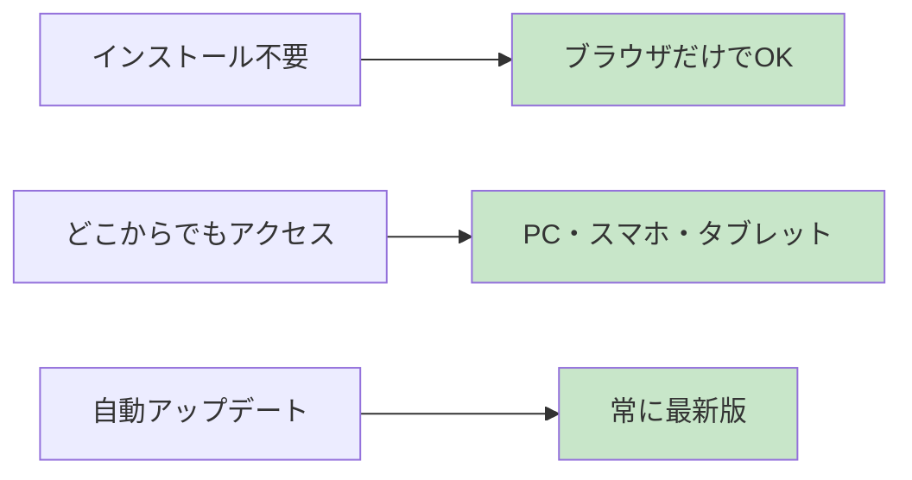

---

## Web の仕組み

### 基本的な流れ

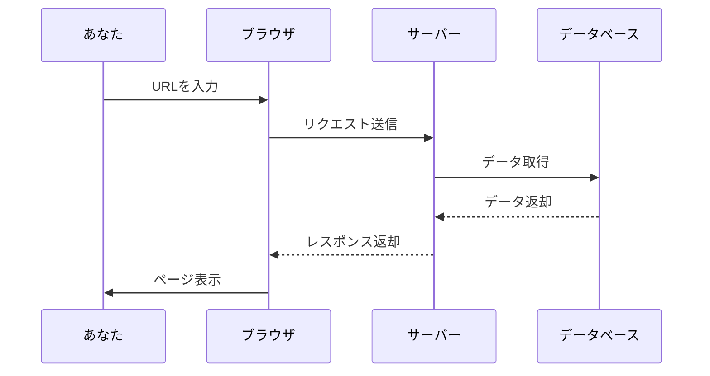

### URL の構造

```
https://example.com:8080/api/users/123?name=john#profile
|____| |_________| |__| |_________| |________| |_____|
  1        2        3       4           5         6

1. プロトコル (https)
2. ドメイン (example.com)
3. ポート番号 (8080)
4. パス (/api/users/123)
5. クエリパラメータ (?name=john)
6. フラグメント (#profile)
```

---

## クライアント・サーバーモデル

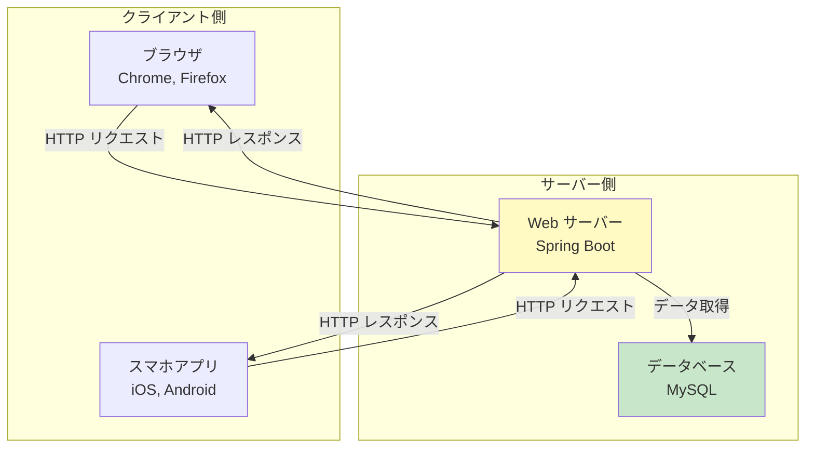

### 役割分担

| 側               | 役割                         | 例                     |
| ---------------- | ---------------------------- | ---------------------- |
| **クライアント** | ユーザーインターフェース     | ブラウザ、スマホアプリ |
| **サーバー**     | ビジネスロジック・データ管理 | Spring Boot アプリ     |
| **データベース** | データの永続化               | MySQL, PostgreSQL      |

---

## HTTP プロトコル

### HTTP メソッド

Web 上でのアクション（操作）の種類を表します。

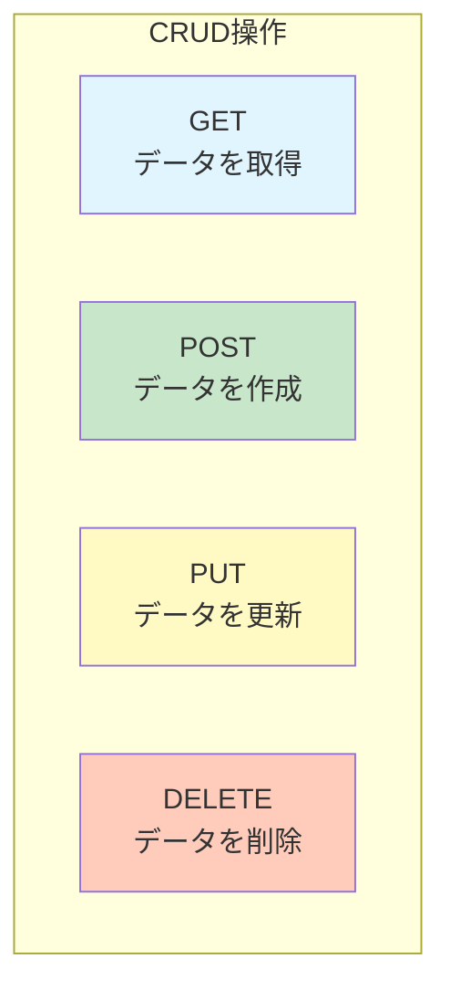

### HTTP ステータスコード

サーバーからの応答結果を表す数値です。

| コード  | 意味               | 例                             |
| ------- | ------------------ | ------------------------------ |
| **2xx** | 成功               | 200 OK, 201 Created            |
| **3xx** | リダイレクト       | 301 Moved Permanently          |
| **4xx** | クライアントエラー | 400 Bad Request, 404 Not Found |
| **5xx** | サーバーエラー     | 500 Internal Server Error      |

### リクエストとレスポンスの例

**リクエスト**:

```http
GET /api/users/123 HTTP/1.1
Host: example.com
Accept: application/json
```

**レスポンス**:

```http
HTTP/1.1 200 OK
Content-Type: application/json

{
  "id": 123,
  "name": "John Doe",
  "email": "john@example.com"
}
```

---

## REST API とは？

**REST** = Representational State Transfer

Web の仕組みを活かした API 設計の考え方です。

### REST API の特徴

```mermaid
graph LR
    A[リソース指向] --> B[/users, /posts]
    C[HTTP メソッド使用] --> D[GET, POST, PUT, DELETE]
    E[ステートレス] --> F[状態を保持しない]

    style B fill:#c8e6c9
    style D fill:#c8e6c9
    style F fill:#c8e6c9
```

### REST API の例

#### ユーザー管理 API

| メソッド | パス             | 説明                  |
| -------- | ---------------- | --------------------- |
| GET      | `/api/users`     | 全ユーザー取得        |
| GET      | `/api/users/123` | ID=123 のユーザー取得 |
| POST     | `/api/users`     | 新規ユーザー作成      |
| PUT      | `/api/users/123` | ID=123 のユーザー更新 |
| DELETE   | `/api/users/123` | ID=123 のユーザー削除 |

---

## Spring Boot アプリケーションの構造

### レイヤーアーキテクチャ

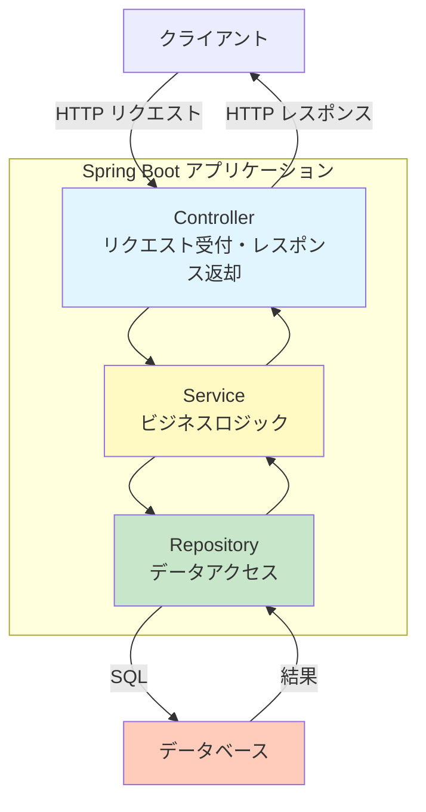

### 各レイヤーの役割

#### 1. Controller（コントローラー）

HTTP リクエストを受け取り、レスポンスを返す。

```java
@RestController
@RequestMapping("/api/users")
public class UserController {

    @GetMapping("/{id}")
    public ResponseEntity<User> getUser(@PathVariable Long id) {
        // リクエストを受け取る
        User user = userService.findById(id);
        return ResponseEntity.ok(user);
    }
}
```

#### 2. Service（サービス）

ビジネスロジック（業務処理）を実装。

```java
@Service
public class UserService {

    public User findById(Long id) {
        // ビジネスロジック
        // - バリデーション
        // - データ変換
        // - 複数のリポジトリを組み合わせた処理
        return userRepository.findById(id)
            .orElseThrow(() -> new ResourceNotFoundException("User not found"));
    }
}
```

#### 3. Repository（リポジトリ）

データベースへのアクセス。

```java
@Mapper
public interface UserRepository {

    Optional<User> findById(Long id);

    List<User> findAll();

    void save(User user);

    void deleteById(Long id);
}
```

### プロジェクト構造

```
src/main/java/fjk/app/web/sample/
├── controller/          # Controller層
│   └── UserController.java
├── service/             # Service層（今後追加）
│   └── UserService.java
├── repository/          # Repository層（今後追加）
│   └── UserRepository.java
├── models/              # データモデル
│   ├── domain/          # ドメインモデル（DB）
│   └── presentation/    # プレゼンテーションモデル（API）
├── exceptions/          # 例外処理
│   ├── GlobalExceptionHandler.java
│   └── custom/
└── config/              # 設定クラス
    ├── OpenApiConfig.java
    └── StartupLogger.java
```

---

## 実践: API を作ってみよう

### Step 1: プロジェクトの起動

```bash
# 1. データベースを起動
docker compose up -d

# 2. アプリケーションを起動
make run-api
```

起動すると、以下のようなログが表示されます：

```
╔────────────────────────────────────────────────────────────────╗
║  🚀 Application started successfully!                          ║
╠────────────────────────────────────────────────────────────────╣
║  ➜  Local:     http://localhost:8080                          ║
║  ➜  Network:   http://192.168.1.100:8080                      ║
╠────────────────────────────────────────────────────────────────╣
║  📚 Swagger UI:  http://localhost:8080/swagger-ui.html        ║
║  📖 API Docs:    http://localhost:8080/v3/api-docs            ║
╚────────────────────────────────────────────────────────────────╝
```

### Step 2: Swagger UI で API を確認

ブラウザで http://localhost:8080/swagger-ui/index.html を開きます。

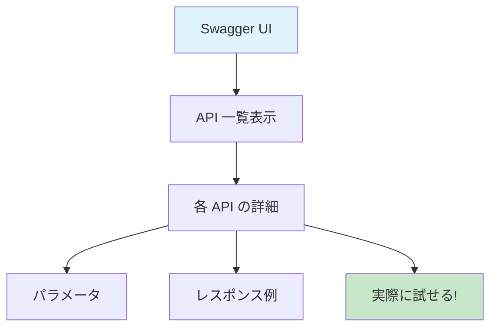

### Step 3: API を実行してみる

Swagger UI から実際に API を実行できます。

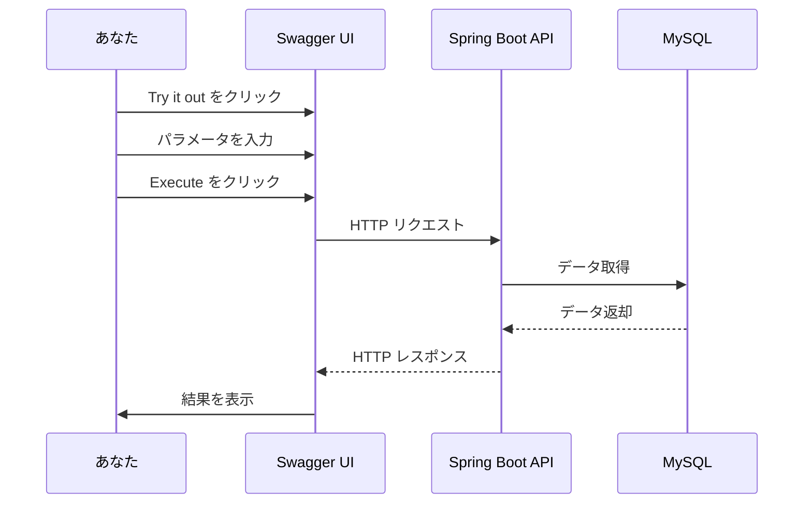

---

## データベースとの連携

### データの流れ

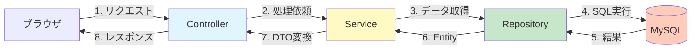

### MyBatis を使ったデータアクセス

#### 1. Entity（エンティティ）の定義

```java
// データベースのテーブルに対応するクラス
@Data
public class User {
    private Long id;
    private String name;
    private String email;
    private LocalDateTime createdAt;
}
```

#### 2. Mapper（マッパー）の定義

```java
@Mapper
public interface UserRepository {

    @Select("SELECT * FROM users WHERE id = #{id}")
    Optional<User> findById(Long id);

    @Select("SELECT * FROM users")
    List<User> findAll();

    @Insert("INSERT INTO users (name, email) VALUES (#{name}, #{email})")
    @Options(useGeneratedKeys = true, keyProperty = "id")
    void save(User user);
}
```

#### 3. Service での利用

```java
@Service
@RequiredArgsConstructor
public class UserService {

    private final UserRepository userRepository;

    public User findById(Long id) {
        return userRepository.findById(id)
            .orElseThrow(() -> new ResourceNotFoundException("User not found"));
    }

    public List<User> findAll() {
        return userRepository.findAll();
    }
}
```

---

## エラーハンドリング

### グローバル例外ハンドラー

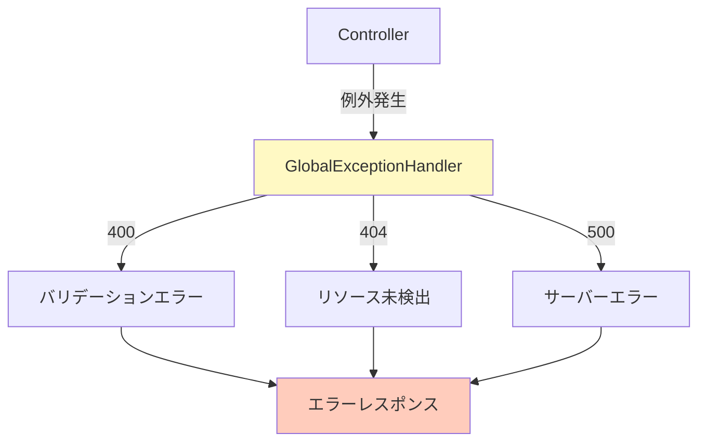

### エラーレスポンスの例

**404 Not Found**:

```json
{
  "code": 404,
  "message": "Not Found",
  "detail": "User with ID 123 not found"
}
```

**400 Bad Request（バリデーションエラー）**:

```json
{
  "code": 400,
  "message": "Invalid Arguments",
  "details": [
    {
      "field": "email",
      "message": "メールアドレスの形式が正しくありません"
    },
    {
      "field": "age",
      "message": "0以上である必要があります"
    }
  ]
}
```

---

## API 設計のベストプラクティス

### 1. RESTful な設計

```mermaid
graph TB
    A[リソース名は名詞] --> B[/users ✅]
    A --> C[/getUsers ❌]
    D[複数形を使う] --> E[/users ✅]
    D --> F[/user ❌]
    G[階層構造] --> H[/users/123/posts ✅]

    style B fill:#c8e6c9
    style E fill:#c8e6c9
    style H fill:#c8e6c9
    style C fill:#ffccbc
    style F fill:#ffccbc
```

### 2. 適切なステータスコードを返す

| 操作           | 成功時のステータス |
| -------------- | ------------------ |
| GET（取得）    | 200 OK             |
| POST（作成）   | 201 Created        |
| PUT（更新）    | 200 OK             |
| DELETE（削除） | 204 No Content     |

### 3. バリデーション

```java
@Data
public class CreateUserRequest {

    @NotBlank(message = "名前は必須です")
    @Size(max = 50, message = "名前は50文字以内で入力してください")
    private String name;

    @NotBlank(message = "メールアドレスは必須です")
    @Email(message = "メールアドレスの形式が正しくありません")
    private String email;

    @Min(value = 0, message = "年齢は0以上である必要があります")
    @Max(value = 150, message = "年齢は150以下である必要があります")
    private Integer age;
}
```

---

## セキュリティ

### 基本的な対策

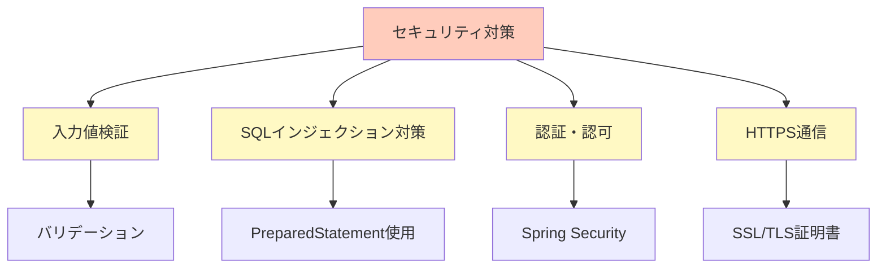

### SQL インジェクション対策

❌ **危険な例**:

```java
// 直接SQL文字列を結合（絶対NG！）
String sql = "SELECT * FROM users WHERE id = " + userId;
```

✅ **安全な例**:

```java
// プレースホルダーを使用
@Select("SELECT * FROM users WHERE id = #{id}")
Optional<User> findById(Long id);
```

---

## パフォーマンス最適化

### N+1 問題

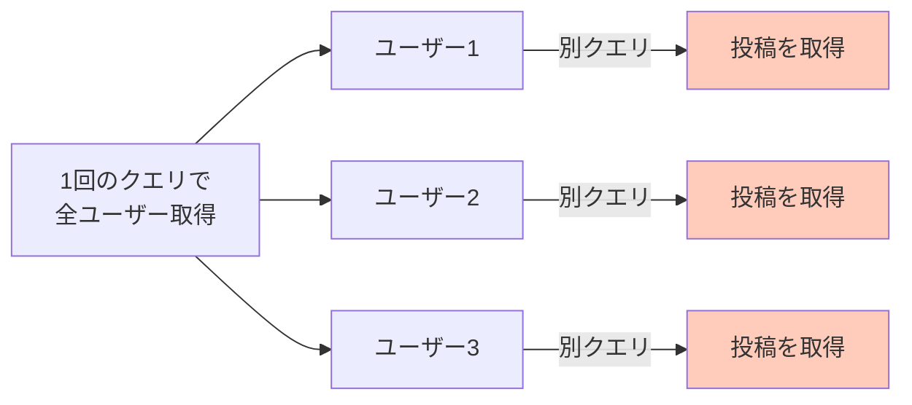

**解決策**: JOIN を使って 1 回で取得

```sql
SELECT u.*, p.*
FROM users u
LEFT JOIN posts p ON u.id = p.user_id
```

---

## 開発のワークフロー

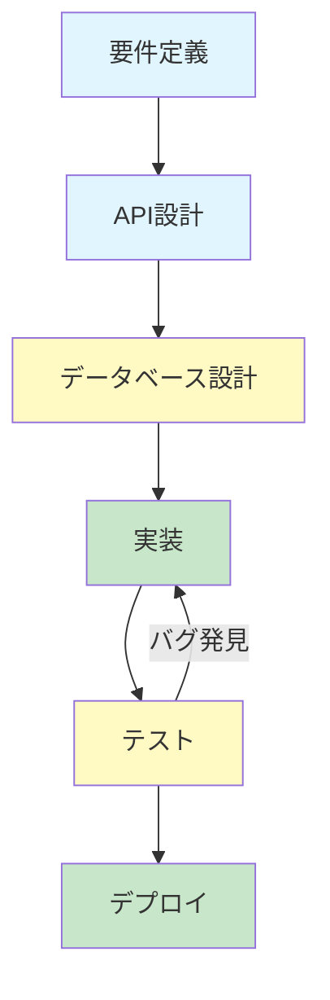

### 実装の順番

1. **データモデル作成** → Entity, DTO
2. **リポジトリ作成** → データアクセス層
3. **サービス作成** → ビジネスロジック
4. **コントローラー作成** → API エンドポイント
5. **例外ハンドリング** → エラー処理
6. **テスト作成** → 単体テスト・統合テスト

---

## まとめ

### 学んだこと

- ✅ ウェブアプリケーションは**クライアント・サーバーモデル**で動く
- ✅ **HTTP プロトコル**でリクエスト・レスポンスをやり取り
- ✅ **REST API** でリソース指向の設計
- ✅ **Spring Boot** でレイヤーアーキテクチャを実装
- ✅ **MyBatis** でデータベースとやり取り
- ✅ **グローバル例外ハンドラー**でエラー処理を一元化

### Spring Boot の主要アノテーション

| アノテーション                 | 用途                       |
| ------------------------------ | -------------------------- |
| `@RestController`              | REST API のコントローラー  |
| `@Service`                     | ビジネスロジック層         |
| `@Repository` / `@Mapper`      | データアクセス層           |
| `@GetMapping` / `@PostMapping` | HTTP メソッドマッピング    |
| `@PathVariable`                | URL パスから値を取得       |
| `@RequestBody`                 | リクエストボディを受け取る |
| `@Valid`                       | バリデーション実行         |

### 次のステップ

1. [Docker 入門](./docker.md) で環境構築の理解を深める
2. 実際に API を追加してみる
3. フロントエンド（React など）と連携してみる
4. 認証・認可機能を追加してみる
5. テストコードを書いてみる

---

## 参考リンク

- [Spring Boot 公式ドキュメント](https://spring.io/projects/spring-boot)
- [MyBatis 公式ドキュメント](https://mybatis.org/mybatis-3/ja/)
- [REST API ガイドライン](https://restfulapi.net/)
- [HTTP ステータスコード一覧](https://developer.mozilla.org/ja/docs/Web/HTTP/Status)
