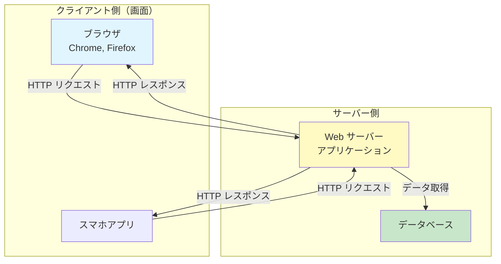
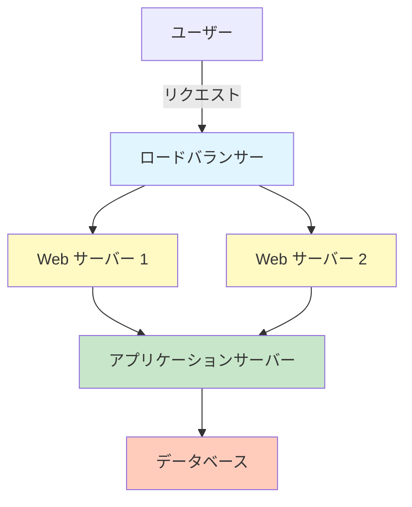
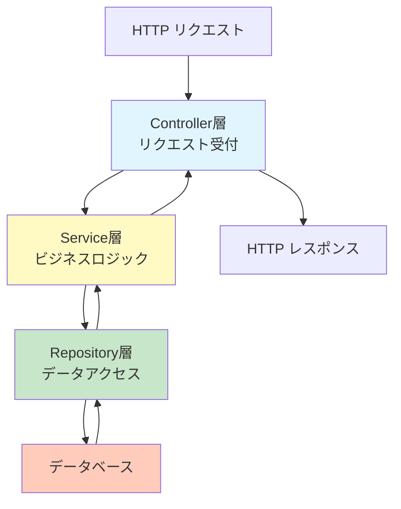

# ウェブアプリケーション入門講座

ウェブアプリケーションの基礎を学びましょう。

## 目次

1. [ウェブアプリケーションとは？](#ウェブアプリケーションとは)
2. [Web の仕組み](#web-の仕組み)
3. [サーバー側の構造](#サーバー側の構造)
4. [HTTP プロトコル](#http-プロトコル)
5. [まとめ](#まとめ)

---

## ウェブアプリケーションとは？

ウェブブラウザを通じて利用できるアプリケーションです。

### 身近な例

- **Twitter**: ツイートの投稿・閲覧
- **Amazon**: 商品の検索・購入
- **Gmail**: メールの送受信
- **YouTube**: 動画の視聴

### ウェブアプリケーションの特徴

- **インストール不要**: ブラウザだけで利用可能
- **どこからでもアクセス**: PC・スマホ・タブレットから利用可能
- **自動アップデート**: 常に最新版が利用可能

---

## Web の仕組み

### 基本的な流れ


### クライアントとサーバー



### 役割分担

| 側               | 役割                         | 例                     |
| ---------------- | ---------------------------- | ---------------------- |
| **クライアント** | 画面表示・ユーザー操作       | ブラウザ、スマホアプリ |
| **サーバー**     | データ処理・ビジネスロジック | Web アプリケーション   |
| **データベース** | データの保存                 | MySQL, PostgreSQL      |

---

## サーバー側の構造

### 一般的なサーバー構成



### 各コンポーネントの役割

#### ロードバランサー（負荷分散装置）

複数のサーバーにリクエストを振り分けます。

**目的**:

- 負荷分散（1 台のサーバーに集中しないようにする）
- 高可用性（1 台がダウンしても他のサーバーで対応）

#### Web サーバー

HTTP リクエストを受け取り、静的ファイル（画像、CSS、JavaScript など）を配信します。

**例**: Nginx, Apache

#### アプリケーションサーバー

ビジネスロジックを実行します。

**処理内容**:

- リクエストの処理
- データベースとの連携
- レスポンスの生成

#### データベース

データを永続的に保存します。

**例**: MySQL, PostgreSQL, MongoDB

### アプリケーションの内部構造

アプリケーションサーバー内部は、通常以下のようなレイヤー構造になっています。



#### 各レイヤーの役割

- **Controller 層**: HTTP リクエストを受け取り、レスポンスを返す
- **Service 層**: ビジネスロジック（業務処理）を実装
- **Repository 層**: データベースへのアクセス

---

## HTTP プロトコル

### HTTP メソッド

Web 上での操作の種類を表します。

| メソッド | 説明         | 例                 |
| -------- | ------------ | ------------------ |
| GET      | データを取得 | ユーザー情報の取得 |
| POST     | データを作成 | 新規ユーザーの登録 |
| PUT      | データを更新 | ユーザー情報の更新 |
| DELETE   | データを削除 | ユーザーの削除     |

### HTTP ステータスコード

サーバーからの応答結果を表す数値です。

| コード  | 意味               | 例                 |
| ------- | ------------------ | ------------------ |
| **2xx** | 成功               | 200 OK             |
| **3xx** | リダイレクト       | 301 Moved          |
| **4xx** | クライアントエラー | 404 Not Found      |
| **5xx** | サーバーエラー     | 500 Internal Error |

### リクエストとレスポンスの例

**リクエスト**:

```http
GET /api/users/123 HTTP/1.1
Host: example.com
```

**レスポンス**:

```http
HTTP/1.1 200 OK
Content-Type: application/json

{
  "id": 123,
  "name": "John Doe"
}
```

---

## まとめ

### 学んだこと

- ✅ ウェブアプリケーションは**クライアント（画面）とサーバー**で構成される
- ✅ **HTTP プロトコル**でリクエスト・レスポンスをやり取り
- ✅ サーバー側は**ロードバランサー、Web サーバー、アプリケーションサーバー、データベース**で構成される
- ✅ アプリケーション内部は**レイヤー構造**で設計される

### 次のステップ

1. [Docker 入門](./docker.md) で環境構築の理解を深める
2. 実際にアプリケーションを動かしてみる
3. フロントエンドとバックエンドの連携を理解する

---

## 参考リンク

- [HTTP ステータスコード一覧](https://developer.mozilla.org/ja/docs/Web/HTTP/Status)
